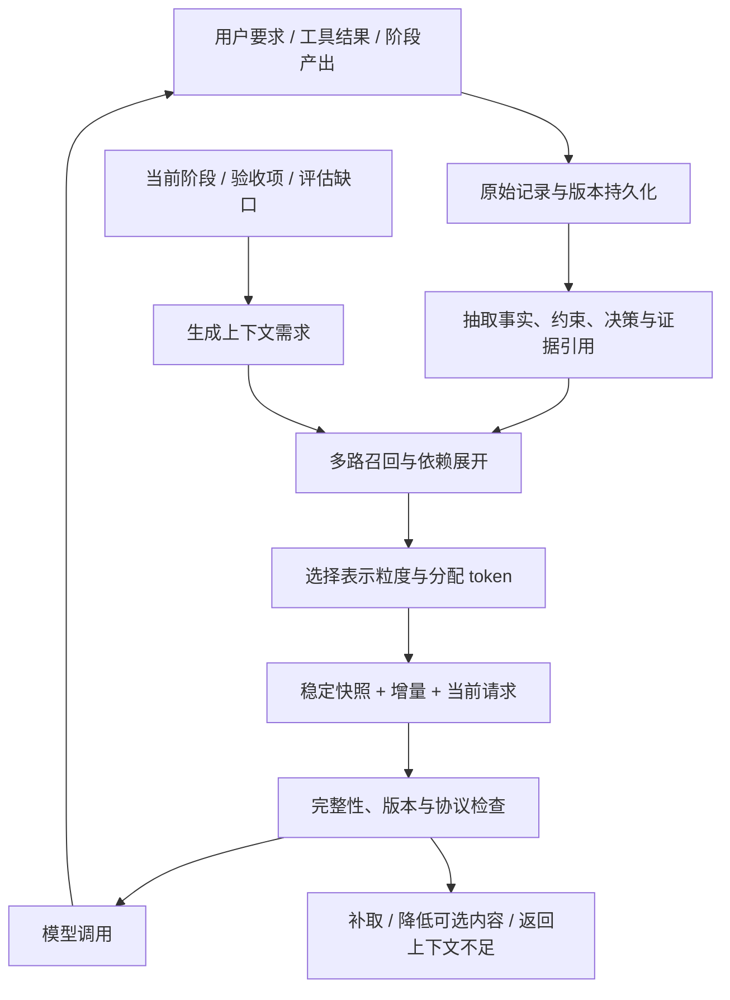

# 上下文管理系统：可追溯记忆、任务视图与稳定快照

状态：设计提案，尚未实现本文机制。日期：2026-09-09。

2026-09-09 补充：已按当前工作区核对 Agent、Harness、API、存储、迁移、测试及前端观测入口；第 12–16 节记录实现缺口、一手资料、接口与验收路径。代码现状以工作区为准，历史总设计中的能力清单不代表已经实现。本文变更仅为设计与研究，没有运行真实模型性能实验。

## 1. 设计主张

将 Context Middleware 实现为一个 Context Compiler：从持久化记忆中，按当前决策需要编译模型输入。它管理信息的表示、选择、排序和版本，不替 Agent 制定研究策略，也不替 Controller 推进阶段。

核心机制为：**原始记录保全 + 结构化事实与约束 + 按需多粒度召回 + 稳定快照与增量日志 + 压缩校验与回退**。

三个目标按优先级处理：先满足当前决策的必要信息，再削减冗余，最后优化缓存。缓存命中不能成为延迟更新重要事实或保留无关长文本的理由。

不能保证有限窗口在所有未来问题上无损。这里区分三种完整性：

| 层面 | 要保证的内容 | 验证方法 |
| --- | --- | --- |
| 存储完整性 | 已成功获取的原始材料、工具交互、用户要求可回溯 | 持久化确认、内容哈希、引用可解析 |
| 决策完整性 | 本次动作需要的约束、关键证据、反例和缺口实际进入输入 | 必需项覆盖检查、任务回放评测 |
| 答案完整性 | 最终结论覆盖验收项，证据与适用条件充分 | 阶段/最终 Evaluator |

“原文还在数据库”只能证明第一层；必须有后两层检查才构成完整方案。

## 2. 与仓库现状的关系

总设计中的 L0–L4 保留，作为存储职责划分；新增的快照/增量是模型输入的组织方式，两者不一一对应。

代码已存在分阶段执行、证据摘要/原文召回和消息持久化，不能继续按“尚无代码”的历史说明设计。可复用入口：

- `app/agent/react.py`：当前通过 `create_agent` 接入消息持久化 middleware；新增上下文装配入口。
- `app/agent/staged/executor.py`：当前阶段交接、重试反馈、前序结论和证据索引；升级为结构化 Handoff。
- `app/agent/evidence_repo.py` 与 `app/agent/tools/evidence.py`：扩展定位读取、多粒度表示和引用完整性。
- `app/agent/middleware/message_persistence.py`：目前为失败只记日志的旁路镜像。不可将“调用过该镜像”当成可以安全移出历史的证明。
- `app/agent/checkpointer.py`：继续负责图执行恢复；只增加上下文快照引用与水位，不另造 checkpointer。

本文只规定接口和行为，具体 middleware hook 需按已安装框架版本落地验证。涉及历史裁剪时，必须先验证来源已经可靠保存；仅做请求视图筛选时不修改原始图消息。

## 3. 数据流与职责



Context Compiler 可以执行确定性的数据库读取、按 ID 补取和有界抽取调用。检索不到的研究事实以 `context_gap` 返回；是否外部搜索由 ReAct 决定。无法满足硬约束时返回 `CONTEXT_INSUFFICIENT`，由上层按配置采取降级或终止，不私自放宽要求。

## 4. 信息完整性：事实保全和压缩契约

### 4.1 记忆对象

统一 MemoryItem 的公共字段：

```text
id, task_id, scope(stage/question), kind
revision, status(active/superseded/rejected/disputed)
content, representation(index/summary/excerpt/raw)
source_refs[{artifact_id, content_hash, locator}]
depends_on[], supersedes[], acceptance_ids[]
observed_at, valid_time, provenance(user/source/derived)
confidence, extraction_version
```

`confidence` 是辅助排序信号，不作为事实为真的证明。`observed_at` 与事实适用时间 `valid_time` 分开；“刚抓取”不等于“内容最新”。外部来源始终标记为资料，不提升为 system 指令。

主要对象：Constraint、Claim、Evidence、Decision、FailedAttempt、OpenGap。当前没有完整 Claim 图时，可先用 Finding 与 Evidence ID 关系落地，不先引入图数据库。

证据项至少包含：精确摘录、来源版本、定位、日期、数值单位、适用范围、支持/反驳哪个命题。摘要不能作为精确引用的来源。

### 4.2 必需信息清单

每次装配生成 `RequiredContextSet`，不是对所有历史一律置顶：

- 任务硬约束、当前阶段目标、验收标准与排除范围。
- 当前未完成的工具调用及其协议依赖。
- 当前决策明确依赖的 Claim/Evidence 与必要适用条件。
- 当前命题已知的重要反例、撤回记录和未解决争议。
- 阶段重试时的失败原因及本轮必须修复的缺口。

必需项按对象 ID 和最低表示级别校验，例如“证据 E17 必须以 excerpt 进入”，仅放 E17 的索引不算覆盖。清单中的部分语义依赖来自模型抽取，存在遗漏风险；需要规则兜底、代表性回放和未索引材料提醒，不能宣称机械校验能证明所有关键事实都被发现。

### 4.3 压缩契约

一次压缩输出 `CompactionManifest`：

```text
source_message_ids / source_event_range
preserved_item_ids + representation
omitted_items[{id, reason, recover_ref}]
unprocessed_source_refs
required_set_version, extractor_version
validation_result, snapshot_ref
```

保留规则：用户约束尽量直接复制有效字段；数字、单位、否定、前提和例外保留原始摘录；重要反证和失败尝试不能因“不是正面结论”而消失。展示摘要只服务导航，不能覆盖事实账本。

压缩过程：先保存原始记录，再抽取增量，再做必需项和来源校验，最后发布新快照。**不反复用“旧摘要 + 新历史”生成唯一的新摘要**；阶段摘要应从有效的原子记忆与可定位原文重建。

校验包含结构检查、引用哈希/定位检查、已标注必需项覆盖检查。高价值阶段交接可追加一次有界语义审计，检查新摘要是否改变原文含义。语义审计失败时保留旧快照，补上遗漏摘录；不能为满足压缩比例而静默通过。

持久化或提取失败时，相关交互不得从可恢复的执行状态中移出。必要项过大则减少可选内容，仍不够返回上下文不足。禁止简单裁切到 token 上限后继续执行。

### 4.4 补取闭环

模型发起 `recall(memory_id, locator, max_tokens)` 时，默认返回当前问题相关的段落及邻近限定语，附原文版本与继续读取游标；全文通过分页可达。读取硬上限与 token 预算联动。

在“引用精确数字、多个来源冲突、证据日期不清、开始综合结论”等情形，Compiler 根据结构化依赖主动补取，不仅依赖模型自觉发现摘要遗漏。

## 5. 信息效率：按决策需要选择信息及粒度

### 5.1 四级表示

| 级别 | 内容 | 使用场景 |
| --- | --- | --- |
| Index | 标题、ID、主题、日期、可用定位 | 提供有哪些可召回材料 |
| Summary | 结论、范围、证据引用、争议标记 | 研究导航和阶段交接 |
| Excerpt | 相关原文、单位、前后限定语 | 判断事实、对比与引用 |
| Raw | 原始文档的相关完整区段或分页 | 检查遗漏、复杂表格和原文复核 |

同一对象通常只选择一个级别，避免重复塞入摘要与全文。发生数据更新必须使旧表示失效；不同表示共享来源版本但有各自内容哈希。

### 5.2 多路召回与覆盖约束

召回由三路并集构成：当前问题的语义/关键词检索、验收项与 Claim 依赖查询、强制加入的有效约束/争议/失败记录。先按 task 与允许的角色视图过滤，再排序；不能先跨任务检索再靠 prompt 隔离。

先覆盖 RequiredContextSet，再将剩余预算分给边际价值高的候选。启发式可表示为：

```text
边际价值 = 新增子问题覆盖 + 相关性 + 来源质量 + 依赖价值
         - 与已选内容的重复程度 - 过时风险
优先级 = 边际价值 / 当前表示的 token 数
```

第一版采用可解释规则，不需要训练排序模型。关键反证不参与普通候选淘汰；同一报道的转载不算独立来源。去重可以合并文本副本，但保留出处关系与独立来源数量。

### 5.3 两类预算

`hard_input_limit = model_window - reserved_output - provider_specific_reserve`。

`attention_target` 是通过评测得到的较小工作目标，不能直接等同于模型最大窗口。必要信息超过软目标但未超过硬限时允许扩容；减少上下文不是压倒一切的目标。

可用 24k 输入 token 作为实验起点，例如：指令/契约 2k、阶段快照 4k、证据 8k、最近完整交互 6k、增量与当前状态 2k、机动 2k。它不是承诺或通用最佳值；最终要基于实际 tokenizer、工具 schema 和真实输入计数重分配。

不同阶段调整重点：探索偏索引与缺口；验证偏原文与反证；综合偏覆盖矩阵、关键摘录和适用条件。最终综合跨所有验收项检索，不能仅用最后阶段的 Top-K。

## 6. 缓存：稳定快照、追加增量与有界重建

### 6.1 修正两种常见误解

应用层“缓存了文本块”不等于 Provider 命中了前缀。前面发生变化，即使后面的某个块完全相同，也不能据此假定后面的块独立命中。

同一 sub-question 也可能出现新证据、来源撤回或约束更新，因此仅以 question hash 缓存 Relevant Evidence 会造成陈旧上下文。检索结果缓存键需包含任务、角色、问题、检索版本及有效证据水位，或由依赖失效事件驱动刷新。

Provider 文档明确区分前缀缓存和普通对象缓存；例如 Claude 的缓存覆盖 tools、system、messages 的累积前缀，而不是任意独立片段。具体断点、有效期、最短长度和计费放在适配器配置中。参见 [Claude Prompt caching](https://platform.claude.com/docs/en/build-with-claude/prompt-caching)。

### 6.2 请求组织

```text
P0  稳定的工具 schema 与系统规则
P1  有效任务契约：目标、约束、验收标准
P2  阶段/问题 epoch 快照：阶段任务、必要前序结论、证据包
J   epoch 内追加日志：完整交互、新证据、缺口变化、版本变更
D   当前决策提示：现在要解决什么、最新控制状态与预算提示
```

以上为逻辑顺序，实际 system/message 角色与 tool pairing 必须遵循 Provider 协议。不能为了排列前缀伪造消息角色或拆坏工具调用链。

P0、P1 的稳定期较长；P2 在一个 epoch 内冻结。epoch 是若干次围绕同一问题的模型调用，可因问题切换、阶段切换、信息压力或事实更正结束，不要求等同于整个阶段。

新证据先追加到 J，不每轮重写 P2。J 内记录一经发送不重新排序或改写；D 放最后，避免每轮变化的预算/进度破坏前面的历史复用。D 是当轮临时视图，不插入在历史消息前；若要求它进入后续审计记录，则以不可变事件存储，避免下一次重复插入同一提示。

D 只重复当前状态与本次决策焦点，不承载唯一的用户指令、唯一事实或后续理解动作必需的条件。此类信息必须先作为不可变事件进入 J 或更新 P1/P2；否则删除 D 会破坏后续交互的语义完整性。按 ID 补取和上下文摘要也须保存其实际可见版本，以便解释模型为什么作出某个动作。

请求示例：

```text
调用 1：P0 P1 P2 | J1       | D1
调用 2：P0 P1 P2 | J1 J2    | D2
调用 3：P0 P1 P2 | J1 J2 J3 | D3
重建后：P0 P1 P2'| J'       | D4
```

可复用的边界是两次请求实际相同的最长前缀。J2 包含前轮模型回复与工具交互，但 D1 不会原地变成 D2。应通过适配器测试确认移除临时提示后的交互仍满足协议；需要原样保留的 Provider 原生块必须保留。若适配器不支持该布局，退化为仅保证 P0–P2 稳定，不声称历史也能命中。

### 6.3 什么时候重建

- 普通新增材料：进入 J；到窗口/增量阈值时批量合入新快照。
- 子问题或阶段改变：重新选择证据，生成新 P2。
- 验证当前结论的重要新反证：立即进入当前决策必需集；若旧快照已包含被推翻的事实，立即重建相关快照。
- 用户要求或权限发生变化：更新有效契约，立即失效相关前缀；不为缓存保留旧要求。
- 来源撤回或关键数值更正：依赖它的 Claim、摘要和快照失效；普通非关键更新可用带 ID/revision 的短期增量表达，不能长期堆积相互矛盾的版本。

实验起点：预测输入达到工作目标的 75% 时准备压缩候选，达到工作目标时尝试发布；J 超过工作目标的 20% 时评估重建。阈值应由任务回放调整，并配合压缩后目标水位，避免连续每轮压缩。硬输入上限始终单独检查。

重建收益由未来若干调用省下的 token/延迟，与摘要调用、缓存重新预填充成本比较。低剩余调用数时可能不值得压缩；上下文不够或事实失效时仍必须处理，不能被收益公式阻止。

### 6.4 确定性与两级缓存

应用缓存保存已渲染快照，键包含 `task_id + role_view + epoch + snapshot_hash + renderer_version`。相同快照不重新让模型改写。冻结数组次序、字段次序和空白规范；随机 ID、当前时间与实时预算放入 trace 或末尾 D，不混进 P0–P2。任务契约和工具集确实变化时允许失效。

Provider 缓存依赖实际请求、模型及服务端条件。记录实际 cache-read/write usage，不能用应用缓存命中或字符串哈希相同替代。阶段工具集尽量稳定，真实权限由执行层核验；权限变化优先于缓存。

缓存只减少重复处理成本，不缩小模型看到的 token 数，也不能消除冗余内容对推理的影响，因此必须同时做信息选择。

## 7. 调用、提交与恢复

一次调用的装配步骤：

1. 读取一致的有效任务状态、角色视图、阶段与记忆水位。
2. 构造 RequiredContextSet，检查当前快照的依赖版本是否有效。
3. 召回缺失项，选择表示；若需语义抽取，走独立且有预算的处理步骤。
4. 决定复用快照或生成压缩候选；仅在校验通过后发布候选。
5. 组装 P0/P1/P2/J/D，执行真实 token 计数、引用检查与工具协议检查。
6. 保存 ContextManifest，执行模型调用，记录 usage；新交互可靠保存后推进水位。

`ContextManifest` 至少包含 `context_id、task/stage/attempt、role_view、snapshot_ref、memory_watermark、item revisions、message ids、renderer_version、request hash、token counts、omission reasons`。哈希用于核验；需能从不可变内容重建请求，不能只有一个哈希。

最小新增持久化对象：`memory_item/revision`、`context_snapshot`、`context_manifest`。快照正文与原始大文本可存 Object Storage，MySQL 保存引用与版本；Redis 只缓存热点数据，不成为记忆真相来源。

发布采用“候选 → 校验 → 比较版本并提交 → checkpoint 引用”的顺序。对象先写入并验证哈希，再以事务提交 metadata，最后更新图引用；不假定 MySQL 与 checkpointer 跨存储原子提交。崩溃后可产生无引用候选，由清理过程处理；恢复优先使用 checkpoint 指向的已提交版本，校验当前有效约束后决定复用或记录一次显式重建。

重试不会重复写入已处理 memory revision；用 source event/action ID 作幂等键。同一输入快照可确定性重建，不意味着模型输出也能确定性复现。恢复期间到达的新指令/取消仍必须生效。

## 8. 阶段交接和 Evaluator 视图

Handoff 包含：有效目标/约束、阶段输出引用、有效 Claim/Evidence 摘录、依赖输出、未解争议、相关失败经验、未处理材料索引。下一阶段按其验收项选取，不强制继承所有前序摘要。

不同角色使用同一事实存储的不同授权视图：执行 Agent 得到当前必要信息；正向审计得到结论和证据；反向挑战按现有设计仅得到待挑战结论。Compiler 不应把执行者证据包复用给反向挑战，破坏其信息隔离。快照和检索缓存均带 `role_view`。

## 9. 贯穿示例

任务：比较 A/B/C 的可恢复性，只接受开源方案，必须说明版本和限制。

1. “只接受开源”进入有效 TaskContract，每轮出现，不能被摘要淘汰。
2. 阅读 A 的长文档后保存原文，只注入 checkpoint 相关摘录与段落索引。
3. 摘录明确“仅支持进程内恢复”；Claim 保存该限定语，不能摘要成“支持崩溃恢复”。
4. 下一轮发现 A 的新版本支持持久化，新证据先进入 J。若比较的是不同版本，保留二者范围；若旧判断针对当前版本且已经失效，则更正 Claim，重建受影响快照。
5. B/C 的无关检索不会让 A 的完整文档持续占窗；综合阶段通过验收矩阵主动召回 A/B/C 的关键证据与例外。
6. 对某个数字只有摘要时，模型不能直接引用；先按 ID 读取原文。获取失败则明确该项未验证，交给 Evaluator 处理。

这条流程同时说明：原文可找回、当前决策所需的限定语不能丢、无关文档不占窗、新信息及时可见、稳定前缀尽量复用。

## 10. 如何证明有效

基线至少包含：全文历史（溢出计为失败）、固定最近窗口、滚动摘要、本文完整方案。采用相同任务/模型/工具返回，离线回放隔离网页变化；再补线上端到端试验观察真实缓存和延迟。

| 目标 | 指标 | 主要陷阱 |
| --- | --- | --- |
| 完整性 | 标注关键事实召回率、约束遵守率、引用与限定语正确率、争议遗漏率 | 只统计引用 ID 存在 |
| 效率 | 每任务输入/输出 token、重复搜索率、无关上下文比例、成功率 | 只看单次 prompt 缩短 |
| 缓存 | 总 cache-read tokens / 总输入 tokens、最长共同前缀、重建次数与原因 | 把含少量缓存的请求算作高命中 |
| 端到端 | 每成功任务总成本、TTFT P50/P95、总耗时、完成率 | 忽略摘要、检索、补取和缓存写入成本 |
| 恢复 | 快照重建一致性、失效版本使用率、信息持久化失败时的行为 | 只验证 worker 能重新启动 |

总输入 tokens 的分母按 Provider usage 归一化，含普通输入、缓存读取和缓存写入，避免不同接口字段重叠导致重复计算。

必须覆盖：早期用户约束在长干扰后仍生效；关键句位于文档中部；数字带单位/否定/条件；反证迟到；同一问题新证据到达；摘要抽取遗漏；来源撤回；阶段重试；压缩发布中崩溃；证据分页；必需项本身超过预算；评估角色隔离。

消融实验分别移除必需集、原文补取、覆盖选择、epoch 稳定快照，判断质量和成本变化。确定性不变量在测试集要求全通过；模型相关指标报告样本量和重复试验的波动区间。原设计 60–80% 缓存命中仅可作为待验证假设，不能作为现有效果。

## 11. 落地顺序

前置步骤：修复第 12 节中的落库前截断、保存失败仍宣称可召回、调用身份缺失和基础指令未接入；补齐所有模型调用的 usage 与工具调用计数。先得到可信基线，再比较上下文策略。

第一步：先做有效任务契约、证据定位、必需集、输入 token 计数和 ContextManifest；打通“引用前补取”，复用已有阶段交接与证据库。

第二步：增加 epoch 快照、J/D 布局、确定性渲染、压缩契约和发布回退，做真实 Provider 缓存观测。同步实现约束变更、关键反证与来源撤回的失效机制；最初可保守地重建整个阶段快照，不能等第三步才处理陈旧事实。

第三步：增加混合检索、按依赖精确失效、覆盖驱动粒度选择及阶段自适应预算。只有回放证明检索规模需要时才引入向量索引。

该系统可讲述的技术重点是：**用可校验的记忆约束压缩损失，用决策依赖提高信息密度，用时间分段的快照与增量协调信息新鲜度和前缀稳定性，最后用质量—成本实验验证取舍。**

设计理念与按需加载/压缩实践可参考 [Anthropic Context engineering](https://www.anthropic.com/engineering/effective-context-engineering-for-ai-agents)；本文的契约、快照协议、阈值和工程分工是面向本仓库的设计提案，不是文献已经验证的结论。

## 12. 当前实现审计：先堵住信息流的断点

### 12.1 可以复用的基础

实际主链为 `worker → staged.graph → plan → human_approval → controller → react → evaluate → controller`。阶段执行按 stage/attempt 建立独立 thread；Controller 是纯规则路由；最终阶段有 `is_final` 与验收条件。Evidence、StageOutput、AgentMessage、MySQL checkpointer 已经提供部分持久化能力。

因此不需要更换 LangGraph，也不需要一开始引入多 Agent、向量数据库或图数据库。第一版围绕现有串行阶段与角色视图建设即可。

### 12.2 具体缺口与影响

| 代码定位（函数名为稳定定位） | 已核实行为 | 对设计的影响 |
| --- | --- | --- |
| `app/agent/tools/search.py::web_fetch` | trafilatura 成功后先执行 `text[:8000]`，fallback 先截到 5000，再保存 | 当前保存的是截断后的正文；后文连外部记忆都没有进入，不能称“全文可召回” |
| 同上 + `evidence_repo.py::save_evidence` | 保存失败被吞掉，工具仍返回“全文已保存”和一个 ID；缺 task_id 时甚至跳过保存 | 必须返回可验证的 PersistReceipt；无回执不能以摘要替代唯一原文 |
| `search.py::parse_fetch_digest` + `executor.py::_harvest_stage_artifacts` | 阶段结束只抽取 digest 的开头，丢弃概览与尾部，再取最早 12 条工具消息 | ReAct 曾见过的中部/尾部材料，Evaluator 可能完全看不到；12 条也不是 12 个独立来源 |
| `executor.py::_build_stage_prompt` | 证据索引取前 30 行；依赖结论按默认 4000 字符截断；其他阶段 findings 持续累加 | 缺少 token 总预算和按验收项选择，存在早期材料偏置及全局增长 |
| `tools/evidence.py::get_evidence`、`tools/outputs.py::get_stage_output` | 一次返回存储中的完整 content/结论，没有分页和调用级 token 上限 | 补取会重新放大现场上下文；应按 locator/query 分页读取 |
| `react.py::_build_agent` 与 `staged/executor.py::react_node` | `_SYSTEM_PROMPT` 仅在旧的 `react.execute_agent` 路径传入；实际 staged 路径只传 HumanMessage，create_agent 未设置 system_prompt | “精确引用前读取原文”等全局规则在主执行路径没有被该常量注入，应由统一 P0 接入 |
| `staged/planner.py::_run_research` | configurable 只有 thread_id，工具读取的 task_id 未传 | 调研网页保存/去重/召回链路不完整，不能仅依赖 thread 命名推断身份 |
| `staged/evaluator.py::_run_reverse_challenge` | 同样缺 task_id；只有 search/fetch 工具，没有原文 recall；reverse thread 未带 attempt | 反向挑战难以复核 digest 之外的原文；重试会继承同 stage 的旧挑战历史，需要显式版本与隔离 |
| `llm.py::extract_token_usage`、`react.py::_build_agent`、`streaming.py` | usage 仅抽取输入/输出总数；ReAct 内部调用直接用模型，不经 call_llm/call_structured；stream callback 只做展示 | ReAct 的计费、缓存命中和总预算尚未闭环；不能用目前 counters 证明成本收益 |
| `harness/budget.py` 与调用点 | 生产代码中 add_tool_call/add_cost 没有调用点；TaskBudgetUsage 有读接口但未见生产聚合写入 | 先建设统一、幂等的调用账本；实时 Redis 累加和 Dashboard 都从该口径派生 |
| `middleware/message_persistence.py` | after_model 旁路写库、失败只记日志，无 ID 的消息跳过，仅存部分消息字段 | 它是业务展示镜像，不能直接担当压缩前的可靠归档；工具返回后、下次 model 前崩溃也需覆盖 |
| `checkpointer.py` 与 `harness/worker.py` | 有 MySQL checkpoint，但 worker 只领取 QUEUED，没有 RUNNING 任务的失联回收 | 可设计快照恢复协议，但端到端自动崩溃恢复还需要独立的 Harness 恢复工作，不能宣称已有 |

以上为静态调用链核查，不把潜在风险描述为已经线上复现的故障。

### 12.3 对旧总设计的修正

根目录 v3 总设计的 L0–L4 划分仍然适用，但第 16.9 节有三点需要按本文理解：

1. “System 始终命中”“同任务始终命中”只能改成“具备复用条件”；首次调用、有效期、模型变化、服务端路由和最短缓存长度都会影响实际命中。
2. question hash 不足以判定证据新鲜度；必须绑定证据版本/水位、任务和角色。相同问题的新反证要立即生效。
3. 60–80% 只能作为实验假设。按块版本缓存渲染文本不意味着 Provider 可以对每个块独立命中；每步重新计算视图也不意味着每步必须改写快照正文。

## 13. 一手实践与近期研究：采纳什么，不直接照搬什么

检索核查日期：2026-09-09。以下区分工程经验、现行 API 文档和近期论文；不把论文实验收益当成本仓库收益。

| 来源 | 可核实的启发 | 本项目采用方式 |
| --- | --- | --- |
| [Anthropic：Effective context engineering，2025-09-29](https://www.anthropic.com/engineering/effective-context-engineering-for-ai-agents) | 按需加载、结构化笔记、压缩；先保障召回再去冗余 | 索引导航 + 定位补取 + 保留约束与缺口；不只保留一段滚动 summary |
| [Manus：Context Engineering，2025-07-18](https://manus.im/blog/Context-Engineering-for-AI-Agents-Lessons-from-Building-Manus) | 稳定前缀、确定性序列化、追加历史，外部存储承载长期材料 | 冻结 epoch 快照；避免每轮重排旧证据；工具集较小，暂不做动态工具检索 |
| [Claude：Context editing，现行文档](https://platform.claude.com/docs/en/build-with-claude/context-editing) | 清除已发送的工具结果会使相关缓存前缀失效；建议一次清除足够内容 | 入窗前做 digest，已入窗内容采用批量轮换；压缩加入缓存重建成本 |
| [OpenAI：Prompt caching，现行文档](https://developers.openai.com/api/docs/guides/prompt-caching) | 历史与工具定义稳定有助于复用；缓存断点、有效期、计费规则随模型代际变化 | ProviderProfile 配置能力与价格；不能把一种模型的阈值与 TTL 写成全局常量 |
| [OpenAI：Compaction，现行文档](https://developers.openai.com/api/docs/guides/compaction) | Responses 提供服务端和独立压缩；返回含不透明 compaction item 的上下文 | 作为可选适配器能力；保留原生 item，不代替可审计的事实账本；独立 compact 返回窗口应原样使用 |
| [Claude：Prompt caching，现行文档](https://platform.claude.com/docs/en/build-with-claude/prompt-caching) | 缓存按 tools → system → messages 累积前缀工作 | 断点由适配器映射，不能把后面的 Evidence 块当独立 KV 缓存 |
| [DeepSeek：Context caching，现行文档](https://api-docs.deepseek.com/guides/kv_cache/) | 自动前缀缓存，公开 hit/miss usage；具体匹配单位有自身约束 | 保留兼容后端；读取 prompt_cache_hit_tokens / prompt_cache_miss_tokens，未知能力不猜测 |
| [LangChain：Context engineering，现行文档](https://docs.langchain.com/oss/python/langchain/context-engineering) | 区分当次模型视图与持久状态，middleware 可调整请求 | 第一版用 wrap_model_call/request.override 修改输入视图；归档与图状态轮换是另外的提交步骤 |
| [TokenPilot v2，2026-08-28 修订](https://arxiv.org/abs/2606.17016v2) | 同时研究入口减噪与按生命周期批量移出内容，明确讨论文本稀疏性与缓存连续性的冲突 | 支持“两种节奏”：新结果即时处理、旧历史批量重建；论文基准不同，只借鉴机制并自行回放验证 |

当前代码使用可配置 base_url 的 ChatOpenAI，不能推断部署一定是 OpenAI，也不能因接口兼容就假定支持 Responses compaction 或特定缓存参数。本文不读取密钥配置；最终 ProviderProfile 应由部署显式指定。

## 14. 可直接拆成实现任务的接口与运行协议

### 14.1 最小模块

建议新增 `app/agent/context/`，以少量可独立验证的组件落地：

| 模块 | 输入 → 输出 | 边界 |
| --- | --- | --- |
| `schemas.py` | TaskContract / MemoryItem / ContextNeed / Manifest | Pydantic schema，含 revision、provenance、role_view |
| `ingest.py` | 原始工具响应 → PersistReceipt + 有界观察消息 | 先归档再呈现；保留 raw HTML 与 extracted text 的版本关系 |
| `repository.py` | 不可变记录与事务 → 对象引用/已提交水位 | 使用 MySQL，长材料通过 Artifact 引用；MVP 可选 LONGTEXT，不能简单取消截断后继续依赖小 TEXT 容量 |
| `selector.py` | 需求 + 有效记忆 + 预算 → 分级材料集合 | 必需项先行，按验收覆盖去重和选粒度；初版 SQL/关键词即可 |
| `compiler.py` | 选集 + epoch + journal → CompiledContext | 确定性渲染、完整性与协议校验；不执行外部研究 |
| `compactor.py` | 已闭合交互范围 + 原子记忆 → 候选快照与压缩清单 | 失败保留旧版本；摘要模型走预算并关闭递归压缩 |
| `provider.py` | 模型/后端能力 → token、缓存、usage 适配 | 保留 Provider 原生消息块，按真实 endpoint 解析 usage |
| `middleware/context.py` | ModelRequest → handler(request.override(...)) | ReAct 请求拦截入口，业务策略仍在 context 包 |

已经检查本地 `.venv` 中 `ModelRequest`：支持 `messages`、`system_message` 和 `override()`；消息列表不包含该独立 system_message。仍须在实现时做真实序列化与多工具调用协议测试。框架提供入口，不会自动实现本文的版本/来源/完整性约束。

### 14.2 数据对象与身份

`ContextScope` 必须显式传递：

```text
task_id, run_id, stage_index, attempt,
role_view, role_view_version, contract_revision,
context_epoch, source_watermark
```

research、executor、reverse、forward、adjudicator、scorer、defense 的调用都通过该身份接入。thread_id 只负责执行线程，不能承担授权与来源命名空间的全部职责。

`PersistReceipt` 至少包含 `artifact_id, content_hash, bytes, committed, extraction_version, source_complete`。若网络下载因大小限制未完整读取，要明确 `source_complete=false`；正文抽取成功也不代表页面中的图片、表格或附件已被完整解析。

新增 `memory_item` 可采用 `(task_id, item_id, revision)` 主键，关系先存 JSON 或普通关系表。新增 `context_snapshot` 保存不可变正文、依赖 revision、水位、renderer_version、提交状态；新增 `context_manifest` 保存每次实际输入的完整引用清单。原始 Provider payload 可放 Artifact，AgentMessage 继续服务 UI。

### 14.3 每次调用的简化算法

以下是接口级伪代码，不是可直接复制运行的实现：

```python
scope = resolve_scope(runtime)
state = repo.read_consistent_state(scope)
need = derive_need(state.contract, state.stage, state.gaps, state.role_view)

snapshot = repo.get_committed_snapshot(scope)
if not snapshot or snapshot.has_invalid_dependencies(state):
    snapshot = build_and_validate_candidate(need, state)
    snapshot = repo.publish_if_versions_match(snapshot)

# 普通新增信息经 ingestion 成为有界且不可变的 journal 记录。
# 必需但尚未进入 snapshot/journal 的材料，按 locator 补齐后追加。
journal = ensure_required_material_present(snapshot, need, state)
if should_roll_epoch(snapshot, journal, state.budget):
    snapshot, journal = compact_at_closed_turn_boundary(snapshot, journal)

compiled = render(snapshot, journal, current_focus=state.focus)
validate_required_items_and_tool_protocol(compiled, need)
enforce_input_limit(compiled, provider_profile)
manifest = repo.commit_manifest(compiled)
response = invoke_model(compiled, context_id=manifest.id)
record_provider_usage_once(response, context_id=manifest.id)
archive_response_and_advance_watermark(response)
```

候选快照可能无法压到 soft target：完整性先于目标长度。用户硬约束更新必须触发重新编译，不受压缩冷却时间约束。`source_watermark` 前尚未完成抽取的记录须标为 unprocessed，不能静默越过。

编译时补取的摘录也要保存实际发送版本；这些上下文记录使用适配器支持的资料消息表达，不伪造不存在的 tool_call_id。tool call 与全部返回视作闭合交互组；有并行工具时，必须等待相关返回闭合后才能移出该组。

### 14.4 压缩提交与状态大小

第一版只改调用视图，图的原始 messages 不变，便于回归与回放。但这只控制 LLM 输入，不控制 checkpoint 存储增长。

后续要有显式的图状态轮换：确认整个被移出范围已经可靠归档、manifest 可重建、没有未闭合调用后，才用框架支持的消息删除/状态更新机制移出历史，将 snapshot_ref 和水位留在 checkpoint。不能在 wrap_model_call 中假定 override 已经裁剪了持久状态；也不能任由 `add_messages` 将每次快照重复追加。

事务采用预期 revision 比较，防止异步摘要覆盖新约束；压缩期间到达的新工具结果保留在候选水位之后。崩溃后的旧快照仍可用时继续旧快照；涉及已失效要求则先重建。commit 成功、checkpoint 引用未更新时允许产生孤立快照，不能反向覆盖最新状态。

### 14.5 原文召回接口

```text
list_evidence(query?, acceptance_id?, cursor?, max_tokens?)
get_evidence(evidence_id, revision?, locator?, query?, cursor?, max_tokens?)
get_stage_output(stage_index, section?, cursor?, max_tokens?)
```

复用工具名，扩展参数即可。响应统一包含 `source_ref, revision, locator, text, has_more, next_cursor, source_complete`。query 查询没找到时区分 `NOT_FOUND` 与 `UNPROCESSED`，不能把召回失败当成证据不存在。

一个来源可有多个摘录，支持/反驳关系分别记录。当前 `claim_id` 单列不足以表示多对多关系，新增关联表或 memory_item 中的关系数组；来源修订按 artifact revision 创建新条目，不覆写旧引用。

### 14.6 评估角色与信息不足的处理

forward/scorer 应消费结论所引用的真实摘录包，不能沿用“最早 12 条 ToolMessage”作为全量证据。综合阶段构建“验收项 → 主张 → 支持/反证/缺口”的矩阵，补取每项必要材料。

reverse 保持只拿待挑战结论的初始视图，但能读取其本轮搜索获得的原文；配置独立的可见证据集合，不能因为共享 task_id 就获得 executor 的证据包。reverse 的 thread 建议带 attempt 或被挑战结论 revision。单独建立该角色的日志、快照和检索键。

反向搜索超时、JSON 解析失败、原文不可达应记录 `INCONCLUSIVE/DEGRADED`，与“成功核查后无反例”区分。上下文检查失败产生 `ContextBuildResult(status=INSUFFICIENT, missing=...)`，由节点适配为现有 feedback 或明确的领域错误；不能直接把未知状态交给 Controller 默认重试而造成无效循环。若缺的是尚未搜索的资料，以 Gap 交还 ReAct；若必需输入超过硬窗口，应拆分子核查或明确失败。

## 15. 压缩经济性：不能只统计 prompt 变短了多少

### 15.1 预算的三个维度

- 窗口硬约束：`B_input = model_window - output_reserve - provider_reserve`，模型对 reasoning/output 的规则由适配器决定，避免重复扣除。
- 注意力软目标：从 16k/24k/32k 三档回放探索，而不是把 24k 当通用最优值；必要材料可超过软目标。
- 整任务消耗：所有研究、评估、摘要、补取调用均计入累计 tokens/cost。即使每轮只有 24k，十轮重复输入也可能超过目前默认 200k 的任务预算。

工具 schema、system、引用包装、原生消息块都要纳入输入估算。计数优先使用 Provider count API 或对应 tokenizer；无法精确计数时保守估算并记录 `estimated=true` 与误差裕量，不用固定字符/token 比例假装精确。

### 15.2 三种压力处理优先级

1. 工具结果尚未发给模型：先保存原文，去掉导航/重复文本，生成当前问题相关摘录与索引。此时减噪不会修改已经发出的历史。
2. 已发送内容：同 epoch 保持不可变；必要新事实及时追加；只有足够的收益或信息压力才批量移出旧材料。
3. 失效约束、核心事实更正、硬窗口超限：强制更新；成本模型只能决定可选压缩，不能阻止必要纠错。

第一版触发采用确定性阈值，成本模型先仅记录 shadow decision。建议准备阈值为工作目标的 75%，发布阈值为 100%，压缩后目标为 55–65%；至少移出一个有意义的完整交互范围。若必需内容导致达不到目标则放宽软目标，不反复压缩同一批事实。

### 15.3 一个可解释的收益公式

在质量门通过且窗口有余量时，比较未来 h 次调用的总成本：

```text
NetSaving(h) = Σ[C_keep(i) - C_compact(i)]
               - C_summary - C_extract - C_extra_recall

C_call = uncached_tokens × uncached_price
         + cache_read_tokens × read_price
         + cache_write_tokens × write_price
         + output_tokens × output_price
```

token 桶应互斥。某 Provider 把 cache_read/write 算在 input_total 里，另一个则单列，必须归一化。缓存重建造成的 miss/write 已计入 `C_compact`，不要再额外重复加“重建成本”。另报检索/存储费用及 TTFT/总耗时，不把毫秒直接与美元相加。

纯演示：旧的可移出历史 20k token，替代摘要 4k；假设缓存读价是普通输入价的 0.1 倍，下一次摘要需要按普通输入价处理，且没有其他共同前缀受损。旧历史继续读缓存约等价于 2k 普通输入，新摘要首次约 4k，第一次反而多花 2k；之后每次可省约 1.6k 等价输入。还要加摘要生成成本才得到回本轮数。若上游改动同时使更长后缀失效，成本更高。此例仅说明机制，不代表任何 Provider 当前报价。

剩余调用 h 不可精确预测，记录保守区间而不是造一个精确最优策略。到最终报告前可能只剩一轮，通常更值得精确挑选证据而非额外生成多层摘要；出现窗口压力仍必须处理。

### 15.4 Usage 与缓存观测

建立唯一计费入口或统一 callback，覆盖 create_agent 内部调用与 one-shot 调用，以 provider_request_id/逻辑调用 attempt 去重。迁移时关闭 llm.py 原有重复计数；SDK 内部重试尽量显式可观测，响应未知的用量标为 unknown。

每次至少记录：`context_id, purpose, provider/model, input_total, uncached, cache_read, cache_write, output, usage_raw, usage_known, TTFT, latency, cost, price_version, epoch_id, rebuild_reason`。

token 加权命中率为 `Σcache_read / Σinput_total`，同时按角色、冷启动/暖缓存分组；缺 usage 时不能当 0 命中，也不能从统计中悄悄剔除，应展示未知比例。应用快照命中率、最长公共前缀只是诊断指标。

在现有 Dashboard 增加 Context 页签即可：展示输入组成、必需项覆盖、来源定位、移出原因、epoch 切换与实际 cache-read tokens。一次点击可以回答“模型这轮到底看见了什么、为什么没看见另一个材料”。

## 16. 交付里程碑与可展示实验

| 里程碑 | 工作范围 | 验收证据 |
| --- | --- | --- |
| M0：真实基线与来源保全 | 修复 8000/5000 截断、PersistReceipt、scope/P0 接入、全链 usage | 关键句在第 8001 字符之后仍可取回；存储失败不声称成功；研究/执行/评估调用都可计量 |
| M1：有界决策视图 | TaskContract、Evidence 分段、多粒度召回、RequiredContextSet、Manifest | 早期约束、末尾反证、单位与限定语进入实际请求；分页能覆盖全文；Manifest 能重建请求 |
| M2：稳定 epoch 与压缩提交 | 快照/J/D、确定性渲染、压缩校验、基本失效机制、checkpoint 引用 | 同 epoch 保持实际公共前缀；关键更正即时可见；失败候选不发布；工具协议完整 |
| M3：质量—成本优化 | 混合检索、精确依赖失效、阶段预算调参、Context Dashboard | 在独立评测集上给出质量与每成功任务成本的曲线，报告 TTFT 与全部辅助调用成本 |

任务级自动崩溃恢复需要 Harness 增补失联检测、重领与 checkpoint resume，作为与 M2 配合的独立工作；本次上下文层不自行接管任务调度。

评测以当前实现为基线 B0，再比较全文历史、最近窗口、滚动摘要、完整方案。所有策略使用相同修复过的计费入口和原始材料；另保留未修复入口的历史行为回放，用于单独证明 M0 修复效果，避免把抓取修复的收益算成 Context Compiler 收益。

建议起步：30 个固定研究任务，每个至少 3 次运行，包含 20/50/100 次交互长度及跨阶段依赖；先用工具 fixture 固定环境，再跑有序的真实 Provider 缓存实验。预先划分调参与留出任务；质量评审不透露采用了哪种上下文策略。不同策略分开会话并单独测试各自内部复用；路由键不保证物理缓存隔离，冷缓存实验需等待有效期或使用实验专用的不同前缀，同时用实际 usage 确认。共用系统前缀的预热要记录并保持各组条件一致。

可演示的三条情景：

1. **信息完整性**：前期要求“仅开源”；长网页第 9000 字符处写着“商业授权”；大量干扰之后最终推荐必须排除该选项。展示 source → excerpt → constraint/claim → final citation 的链路。
2. **信息效率**：50 次交互中重复返回同一来源及大段无关内容，比较上下文 token 曲线、重复搜索、事实覆盖；正文移出后按 ID 精确召回限定语。
3. **缓存与新鲜度**：同问题连续数轮追加结果，观察暖缓存；第 N 轮加入推翻旧结论的反证，展示必要的快照失效及新结论，明确这次 miss 是正确行为。

硬不变量在测试夹具中要求全部通过：来源引用可解析、已知必需项满足最低表示级别、原生消息与工具协议合法、角色不串数据、未归档材料不被移出。语义质量则报告约束遵守率、关键事实召回、限定语正确率、争议遗漏、最终成功率及重复运行的波动，不能承诺 100% 无损。

项目的技术讲述可以围绕四个可验证决策展开：**事实账本让压缩可追溯；按验收和依赖选择材料让输入更有效；epoch 快照把信息更新与前缀重写分成不同节奏；输入清单和调用账本让每个取舍能被回放与量化。**
